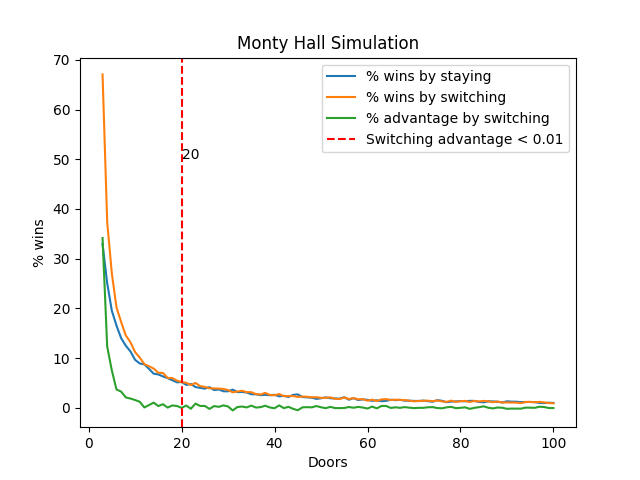
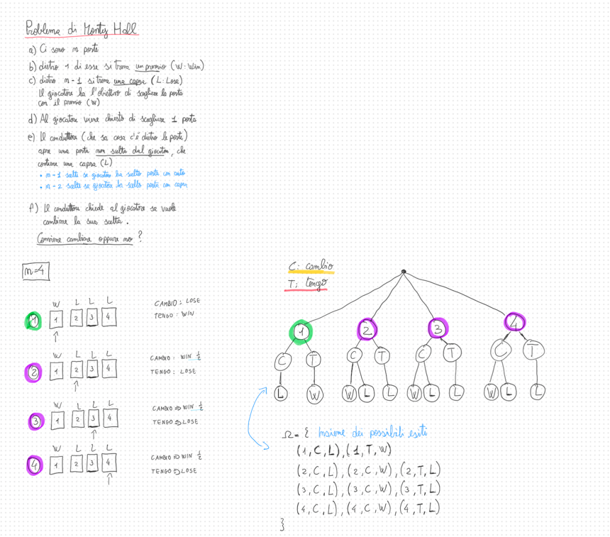
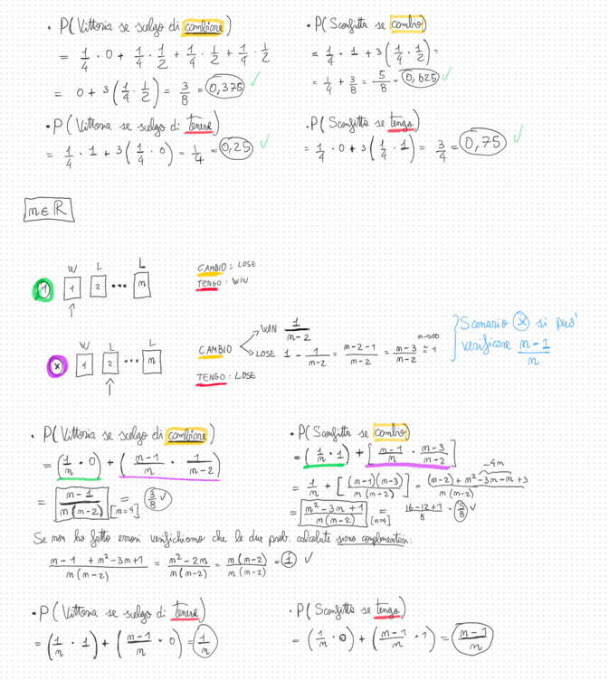
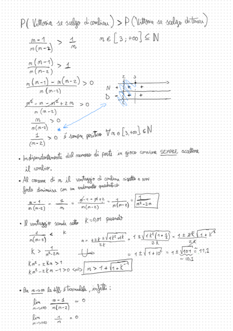

# Monty Hall Problem Simulator
This is a general simulator for the Monty Hall problem.
The original Monty Hall has 3 doors, but this simulator can simulate the problem with more doors.
The problem is as follows:
- You are a contestant on a game show and you are presented with three doors.
- Behind one of the doors is a car, and behind the other two doors are goats.
- You choose a door, and then the host, who knows what is behind each door, opens one of the other two doors to reveal 
  a goat.
- You are then given the option to switch to the other unopened door, or stay with your original choice.
- The question is: is it in your best interest to switch doors?

The [answer](https://en.wikipedia.org/wiki/Monty_Hall_problem) is that it is always in your best interest to switch doors with for n=3, but what if n > 3?


Here below a sample output of the simulator with the following parameters:
```python
    num_simulations=10000,
    doors_start=3,
    doors_end=100,
    logs=True,
```


Here below a whiteboard with notes about a theoretical solution for the problem with n=4 and more doors.
(Results have been validated with the simulation.)
<br>
<br>
<br>
